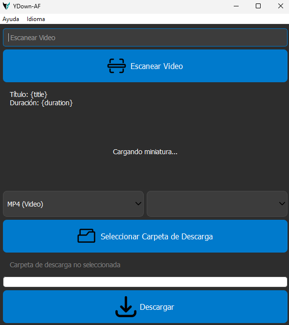
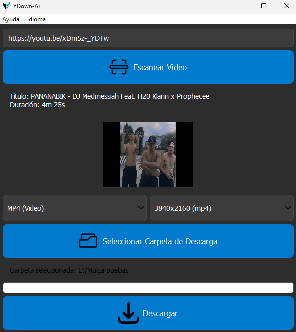
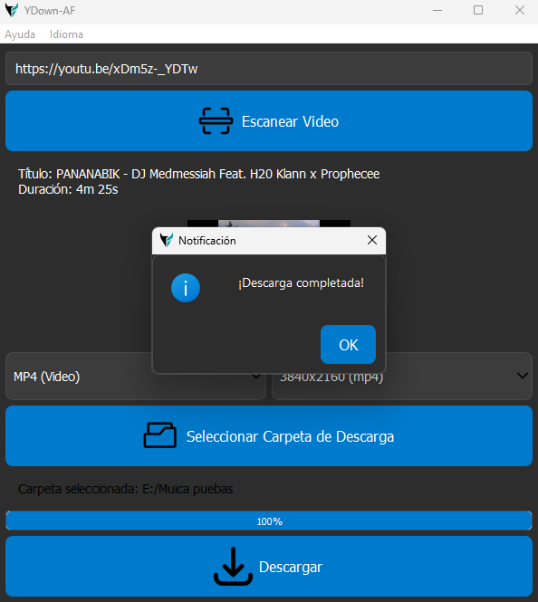

# YDown-AF


YDown-AF es una aplicación moderna y fácil de usar para descargar videos y audios de YouTube. Está diseñada para ofrecer una experiencia fluida y personalizable, con soporte multilingüe y una interfaz gráfica intuitiva.

## Características

- **Descarga de Videos**: Descarga videos en diferentes calidades (MP4).
- **Descarga de Audios**: Descarga audios en la mejor calidad disponible (MP3).
- **Soporte Multilingüe**: Disponible en español e inglés.
- **Interfaz Gráfica Intuitiva**: Diseño limpio y fácil de usar.
- **Configuraciones Personalizables**:
  - Selecciona la carpeta de descarga predeterminada.
  - Cambia el idioma de la aplicación.
  - Elige entre temas claros u oscuros.

## Requisitos

- Python 3.8 o superior.
- Bibliotecas requeridas: `PyQt5`, `yt-dlp`.

## Instalación

1. Clona este repositorio:

   ```bash
   git clone https://github.com/Zblue98/YDown-AF.git
   cd YDown-AF
   ```

2. Crea un entorno virtual e instala las dependencias:

   ```bash
   python -m venv venv
   source venv/bin/activate  # En Windows: venv\Scripts\activate
   pip install -r requirements.txt
   ```

3. Ejecuta la aplicación:

   ```bash
   python main.py
   ```

## Uso

1. **Escanear Video**:
   - Ingresa la URL del video de YouTube en el campo correspondiente.
   - Haz clic en "Escanear Video" para obtener información sobre el video (título, duración, miniatura).

2. **Seleccionar Formato y Calidad**:
   - Elige el formato deseado (MP4 para video o MP3 para audio).
   - Si seleccionas MP4, elige la calidad deseada (por ejemplo, 720p, 1080p).

3. **Seleccionar Carpeta de Descarga**:
   - Haz clic en "Seleccionar Carpeta de Descarga" para elegir dónde se guardarán los archivos.

4. **Descargar**:
   - Haz clic en "Descargar" para iniciar la descarga del video o audio.

## Capturas de Pantalla

### Interfaz Principal


### Selección de Calidad


### Descarga Completada


## Configuración del Usuario

El archivo `config/user_settings.json` permite personalizar la aplicación según tus preferencias. Aquí tienes un ejemplo:

```json
{
    "default_save_path": "/ruta/personalizada",
    "language": "es",
    "theme": "dark"
}
```

- `default_save_path`: La carpeta donde se guardarán los archivos descargados.
- `language`: El idioma de la aplicación (`"es"` para español, `"en"` para inglés).
- `theme`: El tema de la aplicación (`"dark"` para modo oscuro, `"light"` para modo claro).

## Contribuciones

Si deseas contribuir al proyecto, ¡eres bienvenido! Puedes:

- Abrir un issue para reportar errores o sugerir nuevas características.
- Enviar un pull request con tus mejoras.

## Licencia

Este proyecto está bajo la licencia MIT. Consulta el archivo [LICENSE.txt](LICENSE) para más detalles.

---

### Notas Adicionales

- **Créditos**: Esta aplicación utiliza las bibliotecas `PyQt5` y `yt-dlp`. Agradecemos a sus desarrolladores por su excelente trabajo.
- **Contacto**: Si tienes preguntas o comentarios, puedes contactarme en [alvis2100@gmail.com](mailto:alvis2100@gmail.com).

---